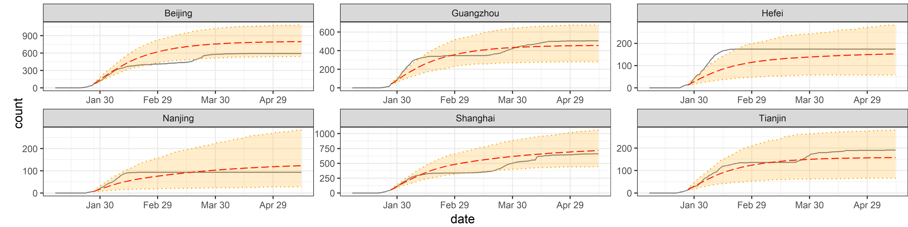
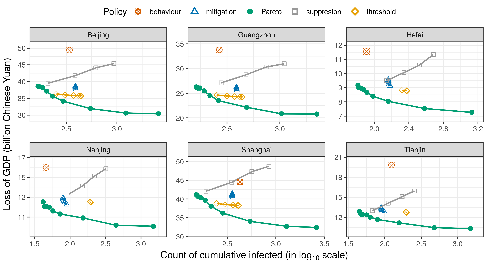
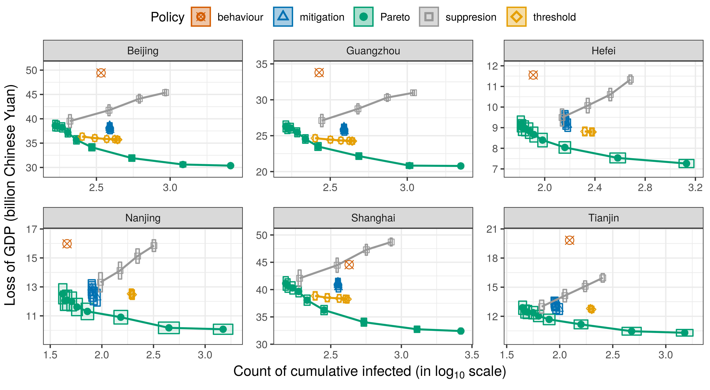

This repository is the official implementation of the paper
“Multi-Objective Reinforcement Learning for Infectious Disease Control
with Application to COVID-19 Spread” submitted to NeurIPS 2020.

Requirements
------------

-   R version 3.6.3 (2020-02-29)
-   Main packages for the proposed estimation procedure
    -   abind
    -   crayon
    -   doFuture
    -   doParallel
    -   foreach
    -   ggplot2
    -   ggpubr
    -   grid
    -   gridExtra
    -   matrixStats
    -   parallel
    -   plyr
    -   randomForest
-   Additional packages for experiments
    -   gtools
    -   dplyr
    -   tidyr

File Overview
-------------

1.  Files in the main folder: scripts for reproducing results.

-   `4_2_sir_pred.R`: script to conduct estimation and validation of the
    transition model in Section 4.2.
-   `4_3_pareto_eval.R`: script to conduct evaluation of the Pareto
    optimal policies in Section 4.3 and Figure in C.3.
-   `C_2_simu_valid.R`: script to conduct cross validation in Section
    C.2.

1.  Files in the `/code` folder
    1.  the proposed method
        -   `SIR.R`: main functions for the generalized dynamics model
        -   `RL.R`: main functions for the reinforcement learning
            algorithms
        -   `utility.R`: helper functions for SIR model and RL parts
    2.  experiments
        -   `simu.R`: main functions for simulation experiments
        -   `simu_utility.R`: helper functions for simulation
            experiments

Reproduce Results
-----------------

To reproduce ourexperiment results in the paper, change the working
directory to the main folder which includs this README file, modify the
`main_path` in the script, run commands below, and read the
corresponding outputs from `/output`.

### Preview data described in Section 4.1

    data = readRDS("./data.rds")
    names(data)

    ## [1] "Beijing"   "Guangzhou" "Hefei"     "Nanjing"   "Shanghai"  "Tianjin"

    str(data$Beijing)

    ## Classes 'tbl_df', 'tbl' and 'data.frame':    120 obs. of  8 variables:
    ##  $ date          : Date, format: "2020-01-15" "2020-01-16" ...
    ##  $ infected_daily: num  0 0 0 0 0 5 5 4 8 14 ...
    ##  $ infected      : num  0 0 0 0 0 5 10 14 22 36 ...
    ##  $ gdp           : num  3.54e+12 3.54e+12 3.54e+12 3.54e+12 3.54e+12 ...
    ##  $ action        : int  1 1 1 1 1 1 1 1 1 2 ...
    ##  $ population    : num  21536000 21536000 21536000 21536000 21536000 ...
    ##  $ gdp_perperson : num  164220 164220 164220 164220 164220 ...
    ##  $ ratio         : num  NA NA NA NA NA ...

### Generate results in Section 4.2

Run `4.2_sir_pred.R` to get the following results:

1.  Figure 2 (./output/Figure2.png)
2.  Table 1 (./output/Table1.txt)
3.  Fitted cost in Section C1 in the supplementary
    (./output/Cost\_in\_C1.txt)

<!-- -->

    cat(readLines("./output/Table1.txt"), sep = '\n')

    ## ---- Result for Table 1: ---- 
    ## 
    ##  t0 =  12 
    ##        mean   std
    ## gamma 0.070 0.005
    ## beta1 0.287 0.011
    ## beta2 0.052 0.005
    ## beta3 0.026 0.004
    ## R01   4.129 0.338
    ## R02   0.744 0.091
    ## R03   0.372 0.058
    ## ------------------------------ 
    ## 
    ##  t0 =  61 
    ##        mean   std
    ## gamma 0.106 0.002
    ## beta1 0.246 0.007
    ## beta2 0.074 0.003
    ## beta3 0.040 0.003
    ## R01   2.318 0.084
    ## R02   0.695 0.029
    ## R03   0.377 0.032
    ## ------------------------------

    

Figure2: Validation results for the six important cities in China.

### Generate results in Section 4.3

Run `4.3_pareto_eval.R` to get Figure 3 (./output/Figure3.png)

    

Figure 3: Cumulative epidemiological costs and economic costs following
different policies, averaged over 100 replications. The closer to the
left bottom corner, the better.

### Generate results in Section C.1 in supplementary

    cat(readLines("./output/Cost_in_C1.txt"), sep = '\n')

    ## C_j:  mean   sd 
    ## C_2: 0.368 0.239 
    ## C_3: 0.484 0.181

### Generate results in Section C.2 in supplementary

    average_error_ratio = readRDS("./output/C2_err.rds");average_error_ratio

    ## average_error_ratio 
    ##           0.1833549

### Generate result in Section C.3 in supplementary

Run `4.3_pareto_eval.R` to get Figure 1 in supplementary
(./output/Figure1\_supp.png)

    

Figure 1 in supplementary: Cumulative epidemiological cost and economic
cost following different policies, averaged over 100 replications. The
closer to the left bottom corner, the better. With the shaded areas
indicating the 95% confidence regions.

